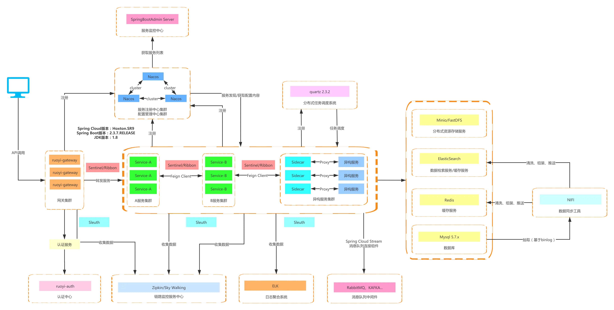

<h1 align="center" style="margin: 30px 0 30px; font-weight: bold;">Gpx v1.0.0</h1>
<h4 align="center">基于 Vue/Element UI 和 Spring Boot/Spring Cloud & Alibaba 前后端分离的分布式微服务架构</h4>

	
	
	

## 平台简介

搞破鞋是一套全部开源的快速开发平台。

* 采用前后端分离的模式。
* 后端采用Spring Boot、Spring Cloud & Alibaba。
* 注册中心、配置中心选型Nacos，权限认证使用Redis。
* 流量控制框架选型Sentinel，分布式事务选型Seata。

## 系统模块

~~~
com.gpx     
├── gpx-ui              // 前端框架 [80]
├── gpx-gateway         // 网关模块 [8080]
├── gpx-auth            // 认证中心 [9200]
├── gpx-api             // 接口模块
│       └── gpx-api-system                          // 系统接口
├── gpx-common          // 通用模块
│       └── gpx-common-core                         // 核心模块
│       └── gpx-common-datascope                    // 权限范围
│       └── gpx-common-datasource                   // 多数据源
│       └── gpx-common-log                          // 日志记录
│       └── gpx-common-redis                        // 缓存服务
│       └── gpx-common-seata                        // 分布式事务
│       └── gpx-common-security                     // 安全模块
│       └── gpx-common-swagger                      // 系统接口
├── gpx-modules         // 业务模块
│       └── gpx-system                              // 系统模块 [9201]
│       └── gpx-gen                                 // 代码生成 [9202]
│       └── gpx-job                                 // 定时任务 [9203]
│       └── gpx-file                                // 文件服务 [9300]
├── gpx-visual          // 图形化管理模块
│       └── gpx-visual-monitor                      // 监控中心 [9100]
├──pom.xml                // 公共依赖
~~~

## 架构图

## 内置功能

1.  用户管理：用户是系统操作者，该功能主要完成系统用户配置。
2.  部门管理：配置系统组织机构（公司、部门、小组），树结构展现支持数据权限。
3.  岗位管理：配置系统用户所属担任职务。
4.  菜单管理：配置系统菜单，操作权限，按钮权限标识等。
5.  角色管理：角色菜单权限分配、设置角色按机构进行数据范围权限划分。
6.  字典管理：对系统中经常使用的一些较为固定的数据进行维护。
7.  参数管理：对系统动态配置常用参数。
8.  通知公告：系统通知公告信息发布维护。
9.  操作日志：系统正常操作日志记录和查询；系统异常信息日志记录和查询。
10. 登录日志：系统登录日志记录查询包含登录异常。
11. 在线用户：当前系统中活跃用户状态监控。
12. 定时任务：在线（添加、修改、删除)任务调度包含执行结果日志。
13. 代码生成：前后端代码的生成（java、html、xml、sql）支持CRUD下载 。
14. 系统接口：根据业务代码自动生成相关的api接口文档。
15. 服务监控：监视当前系统CPU、内存、磁盘、堆栈等相关信息。
16. 在线构建器：拖动表单元素生成相应的HTML代码。
17. 连接池监视：监视当前系统数据库连接池状态，可进行分析SQL找出系统性能瓶颈。